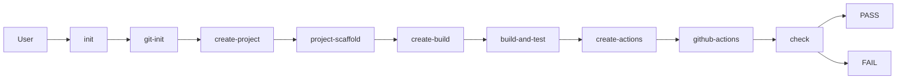

# Architecture

## Agent architecture
The repository uses a GitHub Copilot custom-agent architecture composed of:

- a `build-engineer` custom agent manifest;
- three reusable skills;
- six prompt files;
- a central orchestrator prompt called `init`;
- documentation and validation checks.

The design intentionally separates the repository-level definitions from the actual project creation flow. In `develop`, the repository stores the agent definitions, prompts, skills, and documentation only. The project files are not created there.

## Manifest
The custom agent manifest defines:

- role: Rust Build Engineer;
- purpose: create and validate Cargo-based Rust project files in a feature branch;
- scope: current repository only;
- available skills;
- workflow steps;
- file rules;
- safety constraints;
- forbidden actions;
- failure handling;
- completion criteria;
- idempotency requirements.

The manifest explicitly prevents:

- force push;
- rewrite of Git history;
- deletion of unrelated files;
- branch deletion without explicit permission;
- branch protection changes;
- secret or credential handling;
- hiding failed verification;
- reporting success without successful validation.

## Skills
The three skills are:

- `project-scaffold` for creating the minimal Cargo Rust project and the basic project structure;
- `build-and-test` for adding the library function, test cases, and local CI scripts;
- `github-actions` for creating the cross-platform GitHub Actions workflow.

These skills are real creation tools, not merely planning documents. They are inherited into a feature branch, where the commands are executed to generate the project artifacts.

## Commands
The command prompts are:

- `git-init`
- `create-project`
- `create-build`
- `create-actions`
- `check`
- `init`

These commands are meant to be executed in a feature branch after the definitions are inherited from `develop`.

## Orchestrator
The `init` command is the top-level orchestrator. It runs the workflow in order and stops immediately on a critical failure:

1. `git-init`
2. `create-project`
3. `create-build`
4. `create-actions`
5. `check`

## Data flow
The workflow moves through repository preparation, project generation, build/test generation, workflow generation, and final verification.

The flow is:

- repository inspection;
- Git readiness and ignore rule validation;
- project generation in the feature branch;
- build/test script generation;
- workflow generation;
- real verification using Cargo build and test.

No secret values or credentials are stored at any stage.

## Error handling
Critical errors are handled explicitly:

- fail the stage;
- stop dependent stages;
- print the failed stage clearly;
- avoid continuation after a failed validation;
- never show success when checks fail.

## Idempotency
The workflow is designed so that re-running it does not:

- duplicate configuration text;
- duplicate prompts or skills;
- overwrite valid files;
- corrupt valid repository content.

The system preserves valid state and only adds or updates what is required.

## Safety constraints
- Only use the current repository.
- Do not modify Git history.
- Do not commit or push.
- Do not touch unrelated files.
- Keep `target/` ignored and untracked in Git.
- In `develop`, keep only the definitions and leave project generation for the feature branch.

## Completion criteria
The workflow is complete only when:

- the definitions are valid in the repository;
- the project is successfully generated in the feature branch via the orchestration flow;
- the build and tests pass;
- the GitHub Actions workflow is valid;
- all checks pass in the final verification stage;
- no hidden verification is present;
- repository state remains valid and safe.

## Note on Rust build configuration
For Rust, the project uses `Cargo.toml` as the build and project configuration file.
`CMakeLists.txt` is not used.

## Final design intent
The repository is intentionally structured as a Copilot agent infrastructure layer. It prepares the instructions, validation logic, and automation templates needed to generate a valid Rust project later, while preserving the repository state and avoiding the prohibited final artifacts for now.
